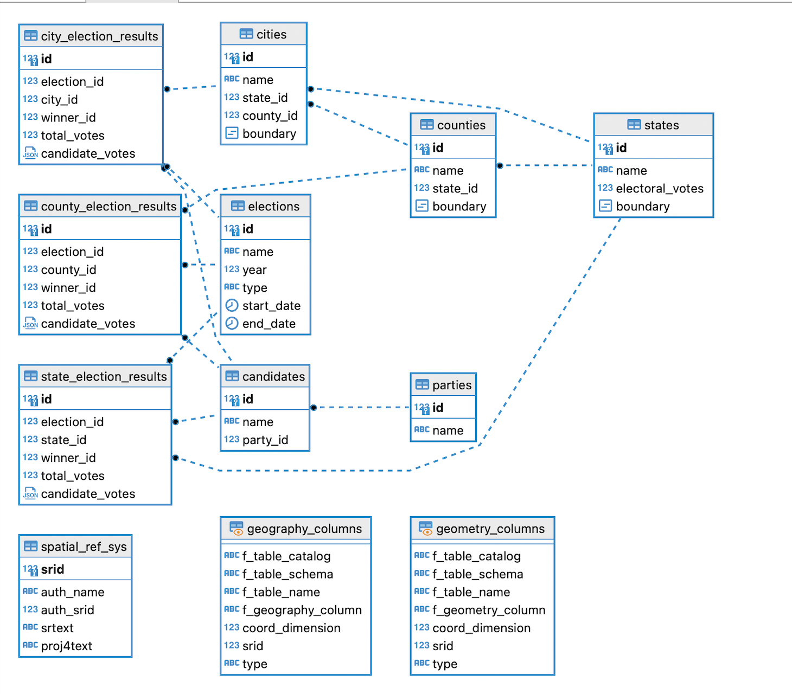

# 🗳️ US Elections API

This project provides an API for accessing data on US elections. The API is built with Node.js, TypeScript, and PostgreSQL, and is powered by the Express.js framework.

## 🚀 Getting Started

To get started with the API, follow these steps:

1. Clone the repository: `git clone https://github.com/example/us-elections-api.git`.
2. Install dependencies using `yarn`: `yarn install`.
3. Run database migrations: `yarn run typeorm migration:run`.
4. Start the server: `yarn start`.

Once the server is running, you can access the API at `http://localhost:3000`.

## 🔗 API Endpoints

The following endpoints are available:

### `/api/v1/elections`

- `GET /api/v1/elections`: Returns a list of all elections.
- `GET /api/v1/elections/:id`: Returns details of a specific election.

### `/api/v1/candidates`

- `GET /api/v1/candidates`: Returns a list of all candidates.
- `GET /api/v1/candidates/:id`: Returns details of a specific candidate.

### `/api/v1/parties`

- `GET /api/v1/parties`: Returns a list of all parties.
- `GET /api/v1/parties/:id`: Returns details of a specific party.

### `/api/v1/states`

- `GET /api/v1/states`: Returns a list of all states.
- `GET /api/v1/states/:id`: Returns details of a specific state.
- `GET /api/v1/states/:id/election-results`: Returns the election results for a specific state.

### `/api/v1/counties`

- `GET /api/v1/counties`: Returns a list of all counties.
- `GET /api/v1/counties/:id`: Returns details of a specific county.
- `GET /api/v1/counties/:id/election-results`: Returns the election results for a specific county.

### `/api/v1/cities`

- `GET /api/v1/cities`: Returns a list of all cities.
- `GET /api/v1/cities/:id`: Returns details of a specific city.
- `GET /api/v1/cities/:id/election-results`: Returns the election results for a specific city.

## 🗂️ Data Model

The data model for the API is as follows:

- `Election`: Represents an election, with a name, year, type, start date, and end date.
- `Candidate`: Represents a candidate, with a name and a party affiliation.
- `Party`: Represents a political party, with a name.
- `State`: Represents a US state, with a name, number of electoral votes, and geographic boundary.
- `County`: Represents a county within a US state, with a name, geographic boundary, and reference to its parent state.
- `City`: Represents a city within a US state and county, with a name, geographic boundary, and references to its parent state and county.
- `StateElectionResult`: Represents the election results for a specific state, with a reference to the election, state, winner, total votes, and a breakdown of votes by candidate.
- `CountyElectionResult`: Represents the election results for a specific county, with a reference to the election, county, winner, total votes, and a breakdown of votes by candidate.
- `CityElectionResult`: Represents the election results for a specific city, with a reference to the election, city,
